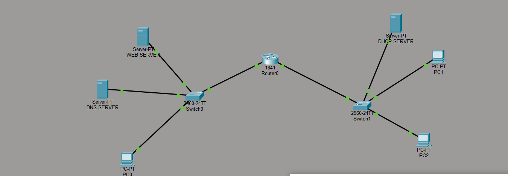

# Network Topology Project

## Overview

This project demonstrates a simple network topology built using Cisco Packet Tracer. The network is divided into two main segments connected through a router.

## Topology Description

* A central **Router (1841)** connects two separate LANs.
* Each LAN is connected via a **switch (2960-24TT)**.
* The network includes:

  * **Web Server**
  * **DNS Server**
  * **DHCP Server**
  * Multiple PCs (clients)

## Key Configuration Details

### Left Side Network

* Connected through **Switch0**.
* Includes:

  * Web Server
  * DNS Server
  * PC0
* This side **does not use a dedicated DHCP server**.
* Instead, IP addresses are assigned using a **DHCP service configured on the router via CLI**.

### Right Side Network

* Connected through **Switch1**.
* Includes:

  * DHCP Server
  * PC1 and PC2
* Devices receive IP addresses from the **dedicated DHCP Server**.

## Functionality

* Devices can communicate across networks via the router.
* DNS server resolves domain names for the web server.
* Clients can access the web server using its domain name.
* DHCP simplifies IP configuration for clients on both sides.

## Network Diagram

## Notes

* Proper IP addressing and gateway configuration are required for successful communication.
* Ensure routing is correctly configured on the router.
* Verify DHCP pools and DNS records for full functionality.

---
